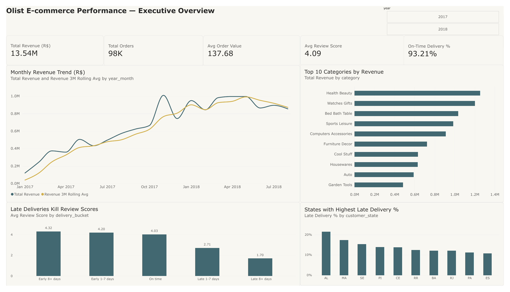
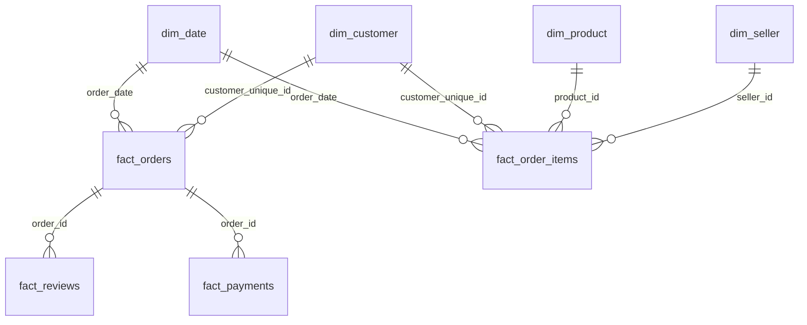
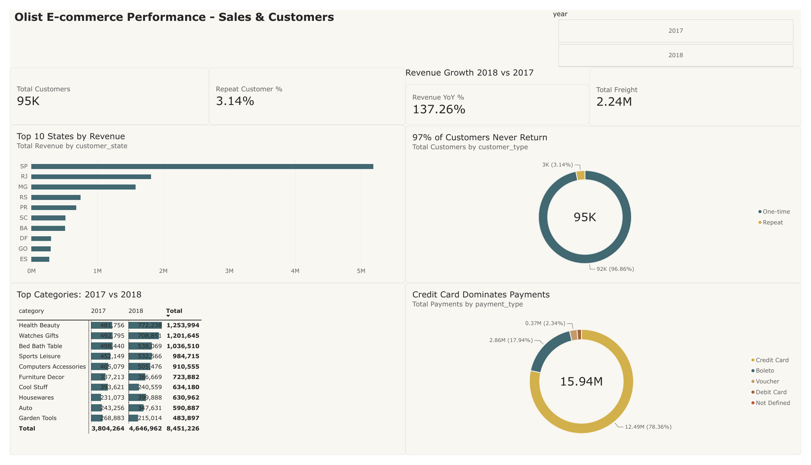
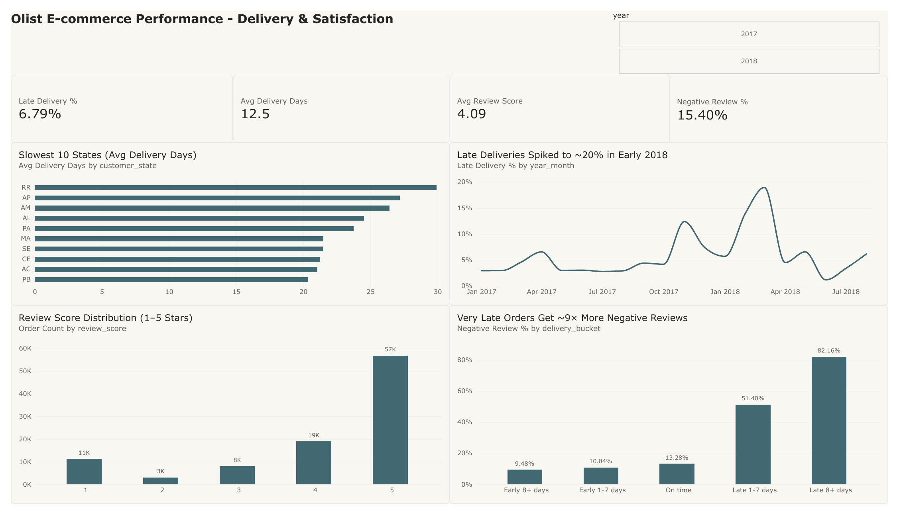

# Olist E-commerce Business Intelligence Dashboard

An end-to-end BI project on **~100K real e-commerce orders** from Olist, a Brazilian online marketplace. Raw data is cleaned in **Python**, modeled as a **star schema** in **Power BI**, analyzed with **20+ DAX measures**, and presented in a **3-page interactive report**.

**Headline finding:** very late deliveries cut the average review score from **4.32 to 1.70** and make negative reviews **~9× more likely**, and **97% of customers never place a second order**. Fixing logistics in a handful of remote states is the biggest lever for satisfaction and retention.



---

## Business questions

1. How is the business performing, and how fast is it growing?
2. Which products and regions drive revenue?
3. Who are the customers, and do they come back?
4. How reliable is delivery, and where does it break down?
5. What drives customer satisfaction?

## Tech stack

| Layer | Tools |
|---|---|
| Data engineering | Python (pandas, NumPy), Jupyter |
| Data modeling | Power BI (Power Query, star schema, relationships, date table) |
| Analytics | DAX (time intelligence, ratios, context-aware measures) |
| Visualization | Power BI Desktop: KPI cards, slicers, Top-N filters, matrix with data bars |

---

## 1. Data pipeline (Python)

Source: the [Brazilian E-Commerce Public Dataset by Olist](https://www.kaggle.com/datasets/olistbr/brazilian-ecommerce) on Kaggle, which has 9 relational tables covering orders, items, payments, reviews, customers, sellers, products, geolocation, and category translations.

The notebook [`notebooks/olist_data_cleaning.ipynb`](notebooks/olist_data_cleaning.ipynb) turns the raw tables into a Power BI-ready star schema. Key steps:

- **Fixed the customer key.** In Olist, `customer_id` is a new ID for *every order*, so without this fix almost every customer looks like a first-time buyer. The pipeline uses the true `customer_unique_id` as the customer key, which is what makes the repeat-customer analysis possible.
- **Engineered delivery metrics:** delivery days, delay vs. promised date, a late flag, and delay buckets (Early 8+ days → Late 8+ days).
- **Deduplicated reviews** and attached the latest review score to each order.
- **Translated** Portuguese product categories to English.
- **Cleaned geolocation:** removed coordinates outside Brazil and averaged to one point per zip prefix.
- **Built a full-year date table** (2016–2018) so DAX time intelligence works correctly.

## 2. Data model (star schema)



| Table | Grain | Rows |
|---|---|---|
| `fact_orders` | One row per order (delivery + review metrics) | 99,441 |
| `fact_order_items` | One row per item sold (sales metrics) | 112,650 |
| `fact_reviews` | One row per review | 99,224 |
| `fact_payments` | One row per payment | 103,886 |
| `dim_customer` | One row per real customer | 96,096 |
| `dim_product` | One row per product | 32,951 |
| `dim_seller` | One row per seller | 3,095 |
| `dim_date` | One row per day (2016–2018) | 1,096 |

**Design decisions:**
- All relationships are **one-to-many with single-direction filtering**, which avoids ambiguous filter paths.
- `fact_orders` and `fact_order_items` deliberately have **no direct relationship**. They connect only through shared dimensions, so filters behave predictably.
- All measures live in a dedicated **`_Measures` table**.

## 3. DAX highlights

All measures are in [`dax/measures.dax`](dax/measures.dax). The Power BI file itself is available under [Releases](https://github.com/rsavinash25-maker/olist-ecommerce-bi/releases/latest). A few worth noting:

**Honest year-over-year growth.** A naive YoY measure showed +328% with no year selected, because it compared all data against a mostly empty 2016. This version only returns a value when exactly one year is in context:

```dax
Revenue YoY % =
VAR _yoy = DIVIDE([Total Revenue] - [Revenue PY], [Revenue PY])
RETURN IF(HASONEVALUE(dim_date[year]), _yoy)
```

**3-month rolling average** to smooth monthly noise:

```dax
Revenue 3M Rolling Avg =
VAR _period = DATESINPERIOD(dim_date[date], MAX(dim_date[date]), -3, MONTH)
RETURN DIVIDE(CALCULATE([Total Revenue], _period), 3)
```

**Grain-aware counting.** Sales measures count from `fact_order_items` so they slice correctly by product and seller, while delivery and review measures use `fact_orders`.

## 4. Report pages

The analysis window is **Jan 2017 – Aug 2018**. The sparse first and last months are filtered out so trends don't show artificial drops. A synced **year slicer** works across all pages.

### Executive Overview
Revenue, orders, average order value, review score, on-time delivery, the monthly revenue trend, top categories, and the delivery-vs-review relationship.

### Sales & Customers


### Delivery & Satisfaction


A full PDF export of all three pages is in [`reports/Olist_BI_Dashboard.pdf`](reports/Olist_BI_Dashboard.pdf), and the `.pbix` file can be downloaded from [Release v1.0](https://github.com/rsavinash25-maker/olist-ecommerce-bi/releases/latest).

---

## Key insights

**Growth**
- **R$13.54M** in product revenue from **98K orders** (average order value R$137.68).
- Revenue grew **+137%** in Jan–Aug 2018 vs. Jan–Aug 2017, reaching about **R$1M per month**, with a visible **Black Friday spike in Nov 2017**.
- **Health & Beauty** (R$1.25M) and **Watches & Gifts** (R$1.20M) are the top categories.
- **São Paulo (SP)** generates by far the most revenue, nearly 3× the next state (RJ).
- **Credit card** accounts for **78%** of payment value, followed by **boleto** (Brazilian bank slip) at **18%**.

**Delivery & satisfaction**
- **93% of orders arrive on time**, but the late 7% do outsized damage:

| Delivery | Avg review | Negative reviews (1–2★) |
|---|---|---|
| Early 8+ days | 4.32 | 9.5% |
| On time | 4.03 | 13.3% |
| Late 1–7 days | 2.71 | 51.4% |
| Late 8+ days | **1.70** | **82.2%** |

- Late deliveries **spiked to ~20% in early 2018**, following the late-2017 peak season.
- Remote northern states (**RR, AP, AM**) average **25–30 days** to deliver, more than double the **12.5-day** average.
- Reviews are **polarized**: there are as many 1-star reviews (11K) as 2-star and 3-star reviews combined (3K + 8K).

**Retention**
- **96.9% of customers buy only once.** The repeat rate is just **3.1%**.

## Recommendations

1. **Prioritize delivery reliability over speed.** Being early adds little satisfaction (4.32 vs. 4.03), but being late destroys it (down to 1.70).
2. **Fix logistics for northern states**, through regional carriers, distribution points, or more realistic promised dates.
3. **Plan capacity ahead of peak seasons** to avoid repeating the early-2018 late-delivery spike.
4. **Launch retention programs** (post-purchase follow-up, loyalty incentives), because with a 3% repeat rate even small gains matter.
5. **Proactively contact customers on late orders**, since an apology or voucher may prevent a 1-star review.

---

## Repository structure

```
├── README.md
├── notebooks/
│   └── olist_data_cleaning.ipynb    # Python pipeline: raw CSVs → star schema
├── dax/
│   └── measures.dax                 # All DAX measures
├── reports/
│   └── Olist_BI_Dashboard.pdf       # PDF export of all pages
└── images/                          # Report screenshots
```

## How to reproduce

1. Download the dataset from [Kaggle](https://www.kaggle.com/datasets/olistbr/brazilian-ecommerce) and place the 9 CSVs in a folder named `olist_raw` next to the notebook.
2. Run `notebooks/olist_data_cleaning.ipynb`. It writes 8 cleaned CSVs to `olist_clean/`.
3. Download `Olist_BI_Platform.pbix` from [Release v1.0](https://github.com/rsavinash25-maker/olist-ecommerce-bi/releases/latest) and open it in Power BI Desktop (Windows). If prompted, point the data source to your `olist_clean` folder (**Transform data → Data source settings**) and refresh.

The data files aren't included in this repo because of their size. The notebook regenerates them.

## Roadmap

- [ ] Move the pipeline into a SQL database (bronze / silver / gold layers)
- [ ] RFM customer segmentation and cohort retention analysis
- [ ] Sentiment analysis on review text
- [ ] Sales forecasting
- [ ] Row-level security by seller region

## Data source & license

Data: [Olist Brazilian E-Commerce Public Dataset](https://www.kaggle.com/datasets/olistbr/brazilian-ecommerce), licensed by Olist under CC BY-NC-SA 4.0. Used here for non-commercial, educational purposes.

---

**Author:** Avinash Rajasekar · [LinkedIn](#) · [Email](#)
